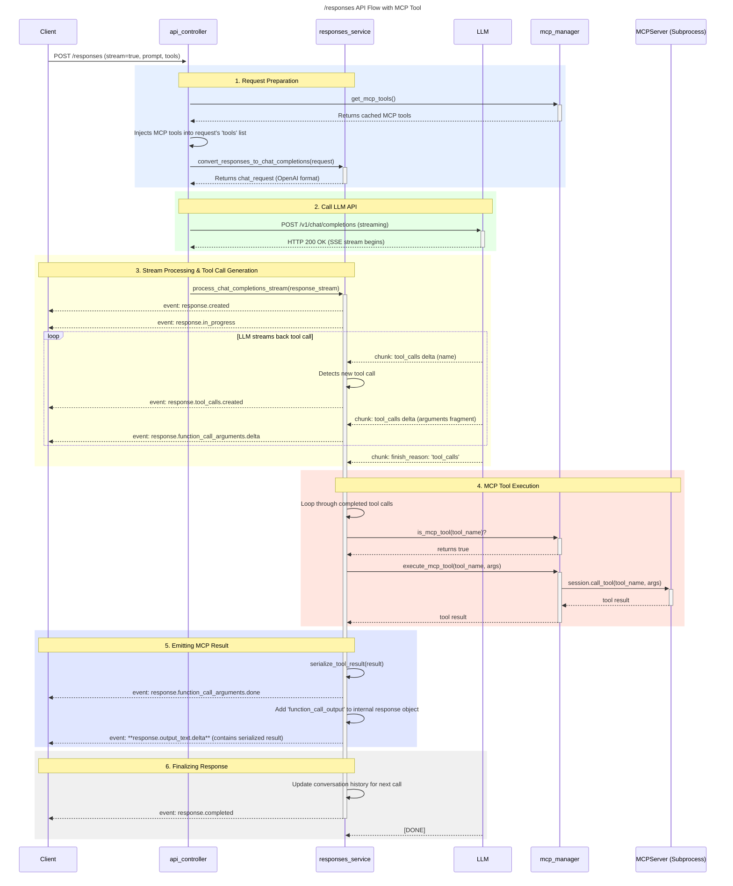

# /responses API Flow with MCP Tool

This document outlines the sequence of events for a `/responses` API call that involves executing a tool via the MCP (Multi-Capability Plane).

```mermaid
sequenceDiagram
    title /responses API Flow with MCP Tool

    participant Client
    participant AC as api_controller
    participant RS as responses_service
    participant LLM
    participant MCPM as mcp_manager
    participant MCPS as MCPServer (Subprocess)

    Client->>+AC: POST /responses (stream=true, prompt, tools)
    
    rect rgb(230, 240, 255)
        note over AC, RS: 1. Request Preparation
        AC->>+MCPM: get_mcp_tools()
        MCPM-->>-AC: Returns cached MCP tools
        AC->>AC: Injects MCP tools into request's 'tools' list

        AC->>+RS: convert_responses_to_chat_completions(request)
        RS-->>-AC: Returns chat_request (OpenAI format)
    end

    rect rgb(230, 255, 230)
        note over AC, LLM: 2. Call LLM API
        AC->>+LLM: POST /v1/chat/completions (streaming)
        LLM-->>-AC: HTTP 200 OK (SSE stream begins)
    end

    rect rgb(255, 255, 224)
        note over RS, Client: 3. Stream Processing & Tool Call Generation
        AC->>+RS: process_chat_completions_stream(response_stream)
        RS-->>Client: event: response.created
        RS-->>Client: event: response.in_progress

        loop LLM streams back tool call
            LLM-->>RS: chunk: tool_calls delta (name)
            RS->>RS: Detects new tool call
            RS-->>Client: event: response.tool_calls.created

            LLM-->>RS: chunk: tool_calls delta (arguments fragment)
            RS-->>Client: event: response.function_call_arguments.delta
        end

        LLM-->>RS: chunk: finish_reason: 'tool_calls'
    end

    rect rgb(255, 230, 224)
        note over RS, MCPS: 4. MCP Tool Execution
        RS->>RS: Loop through completed tool calls
        RS->>+MCPM: is_mcp_tool(tool_name)?
        MCPM-->>-RS: returns true

        RS->>+MCPM: execute_mcp_tool(tool_name, args)
        MCPM->>+MCPS: session.call_tool(tool_name, args)
        MCPS-->>-MCPM: tool result
        MCPM-->>-RS: tool result
    end

    rect rgb(224, 230, 255)
        note over RS, Client: 5. Emitting MCP Result
        RS->>RS: serialize_tool_result(result)
        RS-->>Client: event: response.function_call_arguments.done
        RS->>RS: Add 'function_call_output' to internal response object
        RS-->>Client: event: **response.output_text.delta** (contains serialized result)
    end

    rect rgb(240, 240, 240)
        note over RS, Client: 6. Finalizing Response
        RS->>RS: Update conversation history for next call
        RS-->>-Client: event: response.completed
        LLM-->>RS: [DONE]
    end
``` 