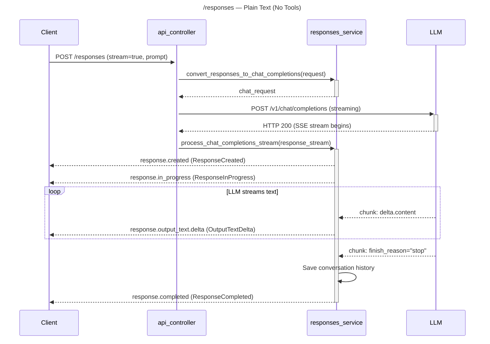
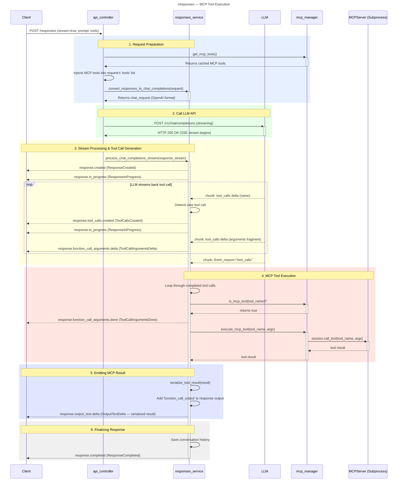
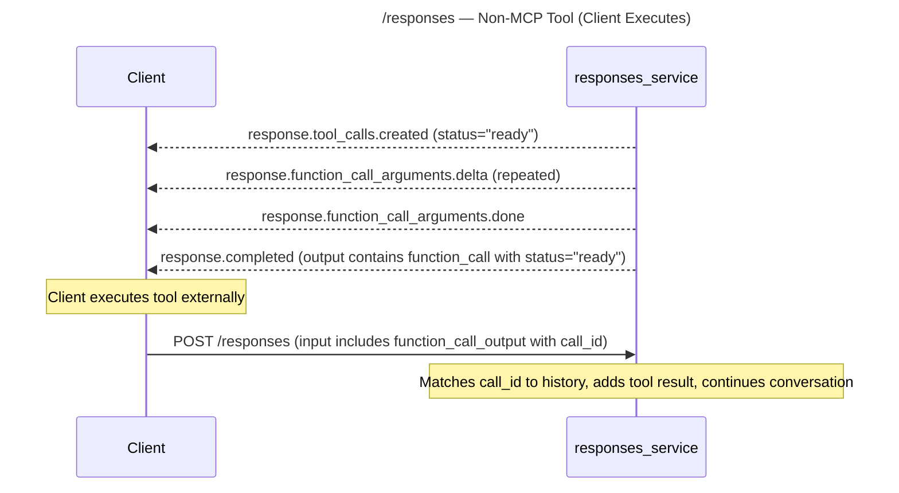
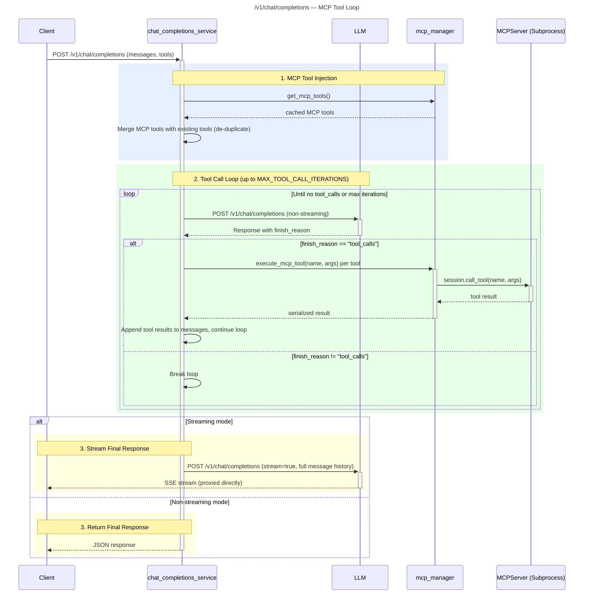

## API Flow Diagrams

Sequence diagrams for the two main API endpoints. For detailed event type
documentation, see [Events & Tool Handling](events-and-tool-handling.md).

## Plain Text /responses Flow (No Tools)

The simplest path — user sends a prompt, LLM responds with text.

## /responses Flow with MCP Tool Execution

Full flow when the LLM invokes a tool registered with the MCP manager.

## /responses Flow with Non-MCP Tool (Client-Executed)

When the LLM calls a tool that is not registered with MCP, the server returns
it to the client for execution.

## /v1/chat/completions Flow with MCP Tool Loop

The chat completions endpoint has its own tool-call loop. Streaming mode uses
non-streaming requests internally during tool resolution, then streams only the
final response.

